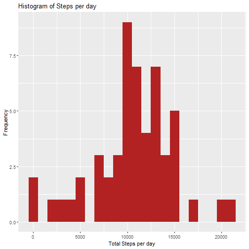
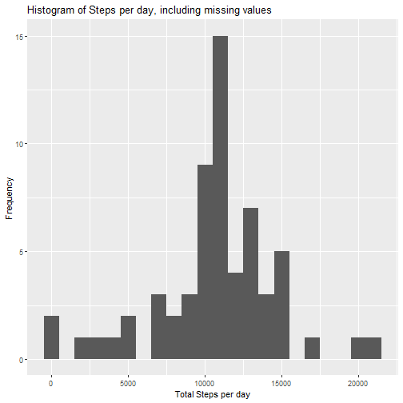
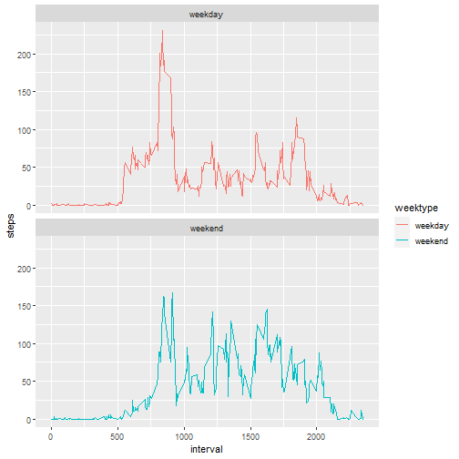

Always include the code that is used to generate the output presented


# Reproducible Research: Peer Assessment 1

## Introduction

It is now possible to collect a large amount of data about personal movement using activity monitoring devices such as a Fitbit, Nike Fuelband, or Jawbone Up. These type of devices are part of the “quantified self” movement – a group of enthusiasts who take measurements about themselves regularly to improve their health, to find patterns in their behavior, or because they are tech geeks. But these data remain under-utilized both because the raw data are hard to obtain and there is a lack of statistical methods and software for processing and interpreting the data.

This assignment makes use of data from a personal activity monitoring device. This device collects data at 5 minute intervals through out the day. The data consists of two months of data from an anonymous individual collected during the months of October and November, 2012 and include the number of steps taken in 5 minute intervals each day.


## Assignment

## Loading the necessary libraries


```r
library(ggplot2)
library(dplyr)
library(lubridate)
```

## Loading and preprocessing the data

**Load the data**

The data for this assignment can be downloaded from the course web site:

Dataset: Activity monitoring data [52K] (https://d396qusza40orc.cloudfront.net/repdata%2Fdata%2Factivity.zip)

The variables included in this dataset are:

steps: Number of steps taking in a 5-minute interval (missing values are coded as NA)

date: The date on which the measurement was taken in YYYY-MM-DD format

interval: Identifier for the 5-minute interval in which measurement was taken

The dataset is stored in a comma-separated-value (CSV) file and there are a total of 17,568 observations in this dataset.


```r
fileurl <- 'https://d396qusza40orc.cloudfront.net/repdata%2Fdata%2Factivity.zip'

if(!file.exists('activity.csv')) {
        download.file(fileurl, 'zipfile.zip', method='curl')
        unzip('zipfile.zip')
        file.remove('zipfile.zip')
}
```

**Show any code that is needed to Load the data (i.e. read.csv())**


```r
activity <- read.csv('activity.csv')
str(activity)
```

```
## 'data.frame':	17568 obs. of  3 variables:
##  $ steps   : int  NA NA NA NA NA NA NA NA NA NA ...
##  $ date    : chr  "2012-10-01" "2012-10-01" "2012-10-01" "2012-10-01" ...
##  $ interval: int  0 5 10 15 20 25 30 35 40 45 ...
```

**Process/transform the data (if necessary) into a format suitable for your analysis**

Change the date into dateformat using lubridate


```r
activity$date <- ymd(activity$date)
```

Check the data with head()


```r
head(activity)
```

```
##   steps       date interval
## 1    NA 2012-10-01        0
## 2    NA 2012-10-01        5
## 3    NA 2012-10-01       10
## 4    NA 2012-10-01       15
## 5    NA 2012-10-01       20
## 6    NA 2012-10-01       25
```


## What is mean total number of steps taken per day?

For this part of the assignment, you can ignore the missing values in the dataset.

**1. Calculate the total number of steps taken per day**


```r
stepsperday <- activity %>%
  filter(!is.na(steps)) %>%
  group_by(date) %>%
  summarize(steps = sum(steps)) %>%
  print
```

```
## # A tibble: 53 × 2
##    date       steps
##    <date>     <int>
##  1 2012-10-02   126
##  2 2012-10-03 11352
##  3 2012-10-04 12116
##  4 2012-10-05 13294
##  5 2012-10-06 15420
##  6 2012-10-07 11015
##  7 2012-10-09 12811
##  8 2012-10-10  9900
##  9 2012-10-11 10304
## 10 2012-10-12 17382
## # … with 43 more rows
```

**2. Make a histogram of the total number of steps taken each day using ggplot**


```r
ggplot(stepsperday, aes(x = steps)) +
  geom_histogram(fill = "firebrick", binwidth = 1000) +
  labs(title = "Histogram of Steps per day", x = "Total Steps per day", y = "Frequency")
```



**3. Calculate and report the mean and median of the total number of steps taken per day**


```r
meanSteps <- mean(stepsperday$steps, na.rm = TRUE)
medianSteps <- median(stepsperday$steps, na.rm = TRUE)
```
Mean steps are 1.0766189 &times; 10<sup>4</sup> and Median steps are 10765


## What is the average daily activity pattern?

**1. Make a time series plot (i.e. type = "l") of the 5-minute interval (x-axis) and the average number of steps taken, averaged across all days (y-axis)**


Average number of steps taken in each 5-minute interval


```r
averageSteps <- activity %>% filter(!is.na(steps)) %>% group_by(interval) %>% summarize(steps = mean(steps))
```

Use ggplot for making the time series of the 5-minute interval and average steps taken


```r
averageSteps %>% ggplot(aes(x=interval, y=steps)) + geom_line()
```


**2. Which 5-minute interval, on average across all the days in the dataset, contains the maximum number of steps?**

Use which.max() to find out the maximum steps, on average, across all the days


```r
maxSteps <- averageSteps[which.max(averageSteps$steps), ]
```
The interval 835 has the maximum steps with 206.1698113` steps


## Imputing missing values

Note that there are a number of days/intervals where there are missing values (coded as NA). The presence of missing days may introduce bias into some calculations or summaries of the data.

**1. Calculate and report the total number of missing values in the dataset (i.e. the total number of rows with NAs)**

Summarize all the missing values:


```r
missingValue <- sum(is.na(activity))
```

Missing values are 2304

**2. Devise a strategy for filling in all of the missing values in the dataset. The strategy does not need to be sophisticated. For example, you could use the mean/median for that day, or the mean for that 5-minute interval, etc.**

We'll fill in the missing values with the average number of steps in the same 5-min interval

**3. Create a new dataset that is equal to the original dataset but with the missing data filled in.**


```r
activityFull <- activity
nas <- is.na(activityFull$steps)
avgStepsFull <- tapply(activityFull$steps, activityFull$interval, mean, na.rm=TRUE, simplify=TRUE)
activityFull$steps[nas] <- avgStepsFull[as.character(activityFull$interval[nas])]
```

Check that there are no missing values:


```r
sum(is.na(activityFull))
```

```
## [1] 0
```

The missing values are 0


**4. Make a histogram of the total number of steps taken each day**


```r
stepsFull <- activityFull %>%
  filter(!is.na(steps)) %>%
  group_by(date) %>%
  summarize(steps = sum(steps)) %>%
  print
```

```
## # A tibble: 61 × 2
##    date        steps
##    <date>      <dbl>
##  1 2012-10-01 10766.
##  2 2012-10-02   126 
##  3 2012-10-03 11352 
##  4 2012-10-04 12116 
##  5 2012-10-05 13294 
##  6 2012-10-06 15420 
##  7 2012-10-07 11015 
##  8 2012-10-08 10766.
##  9 2012-10-09 12811 
## 10 2012-10-10  9900 
## # … with 51 more rows
```

Use ggplot for making the histogram


```r
ggplot(stepsFull, aes(x = steps)) + geom_histogram(binwidth = 1000) + labs(title = "Histogram of Steps per day, including missing values", x = "Total Steps per day", y = "Frequency")
```



**Calculate and report the mean and median total number of steps taken per day. Do these values differ from the estimates from the first part of the assignment? What is the impact of imputing missing data on the estimates of the total daily number of steps?**


```r
meanStepsFull <- mean(stepsFull$steps, na.rm = TRUE)
medianStepsFull <- median(stepsFull$steps, na.rm = TRUE)
```
Mean: 1.0766189 &times; 10<sup>4</sup>, Median: 1.0766189 &times; 10<sup>4</sup>

The impact of imputing missing data with the average number of steps in the same 5-min interval is that both the mean and the median are equal to the same value: 1.0766189 &times; 10<sup>4</sup> 


## Are there differences in activity patterns between weekdays and weekends?

For this part, the weekdays() function may be of some help here. Use the dataset with the filled-in missing values for this part.

**1. Create a new factor variable in the dataset with two levels - "weekday" and "weekend" indicating whether a given date is a weekday or weekend day.**

Use dplyr and mutate to create a new column, weektype, and apply whether the day is weekend or weekday:


```r
activityFull <- mutate(activityFull, weektype = ifelse(weekdays(activityFull$date) == "Saturday" | weekdays(activityFull$date) == "Sunday", "weekend", "weekday"))

activityFull$weektype <- as.factor(activityFull$weektype)

head(activityFull)
```

```
##       steps       date interval weektype
## 1 1.7169811 2012-10-01        0  weekday
## 2 0.3396226 2012-10-01        5  weekday
## 3 0.1320755 2012-10-01       10  weekday
## 4 0.1509434 2012-10-01       15  weekday
## 5 0.0754717 2012-10-01       20  weekday
## 6 2.0943396 2012-10-01       25  weekday
```

**2. Make a panel plot containing a time series plot of the 5-minute interval (x-axis) and the average number of steps taken, averaged across all weekday days or weekend days (y-axis).**

Calculate the average steps in the 5-minute interval and use ggplot for making the time series of the 5-minute interval for weekday and weekend, and compare the average steps:


```r
intervalFull <- activityFull %>% group_by(interval, weektype) %>% summarise(steps = mean(steps))
```

```
## `summarise()` has grouped output by 'interval'. You can override using the
## `.groups` argument.
```

```r
s <- ggplot(intervalFull, aes(x=interval, y=steps, color = weektype)) + geom_line() + facet_wrap(~weektype, ncol = 1, nrow=2)

print(s)
```



From the two plots it seems that the test object is more active earlier in the day during weekdays as compared to weekends, but more active throughout the weekends compared with weekdays (probably because the oject is working during the weekdays, hence moving less during the day)
